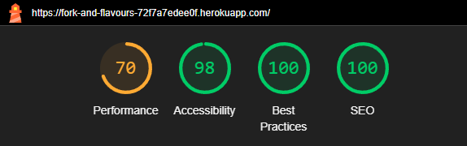

# [ReelRatings](https://fork-and-flavours-72f7a7edee0f.herokuapp.com/)

Fork & Flavour is a recipe manager website that allows authorised users to create, view, edit, and delete recipes. It features a clean, modern, and playful design, offering a seamless user experience with easy navigation and an interactive recipe management system.

[View live website here](https://fork-and-flavours-72f7a7edee0f.herokuapp.com/)

## Table of Contents

- [User Experience (UX)](#user-experience-ux)
  - [Project Goals](#project-goals)
  - [User Stories](#user-stories)
  - [Design](#design)
  - [Wireframes](#wireframes)
- [Features](#features)
- [Database Schema](#database-schema)
  - [Tables](#tables)
  - [Relationships](#relationships)
- [Manual Testing](#manual-testing)
  - [Features Testing](#features-testing)
  - [Browser Compatibility](#browser-compatibility)
  - [Responsiveness Testing](#responsiveness-testing)
  - [Code Validation](#code-validation)
  - [Bugs](#bugs)
  - [Lighthouse Testing](#lighthouse-testing)
- [Technologies Used](#technologies-used)
  - [Languages Used](#languages-used)
  - [Frameworks, Libraries & Tools](#frameworks-libraries--tools)
- [Credits](#credits)
  - [Code](#code)
  - [Media](#media)
  - [Content](#content)

# User Experience (UX)

## Project Goals

- **Intuitive Navigation:** Ensure that users can easily navigate through the site with a clear, simple, and consistent menu and navigation options.
- **Mobile-Friendly Layout:** Provide a responsive design that works seamlessly across all devices, with a mobile-first approach.
- **Minimalist Aesthetic:** Keep the design clean, modern, and visually appealing by incorporating ample white space and an easy-to-read font pairing.
- **User-Centric Functionality:** Design the site with user goals in mind, ensuring that users can easily create, view, edit, and delete recipes without confusion or unnecessary steps.
- **Accessible Design:** Ensure that the website is fully accessible, with considerations for colour contrast, font readability, and screen reader compatibility.
- **Engaging and Interactive Elements:** Implement interactive features like hover effects and checklist functionality for a more dynamic user experience.

## User Stories

- As a new user, I can create an account so that I can access the recipe management features of the website.
- As a registered user, I can log into my account so that I can access my personalised recipe dashboard.
- As a user, I can view the details of a recipe so that I can learn how to make the dish.
- As a logged-in user, I can create a new recipe so that I can share my cooking creations with others.
- As a logged-in user, I can edit my own recipes so that I can update any mistakes or improve the recipe.
- As a logged-in user, I can delete my recipes so that I can remove any outdated or unwanted recipes from my collection.
- As a user, I can browse a list of all available recipes so that I can discover new dishes to try.

These user stories are also tracked on my [Kanban board](https://github.com/users/desireealexia/projects/7) for ongoing project management and development.

## Design

### Colour Scheme

The colour scheme for Fork & Flavour reflects a modern, minimalist, and vibrant aesthetic. The colours are:

- Cal Poly Green (#1F4F31): A deep, rich green used for the main accents and headings.
- Engineering Orange (#B13F26): A warm, vibrant orange used for buttons and interactive elements.
- Chocolate Cosmos (#5B122A): A deep burgundy, used to complement the green and orange accents.
- Buff (#E49E6B): A soft, warm tone used for secondary accents.
- Seashell (#FBF1EE): A light, neutral background colour that provides a clean, airy feel.
- Jet (#333333): A dark grey used for text, providing high contrast and readability.

### Typography

For a clean and modern user interface, the following fonts have been chosen:

- Heading Font: Montserrat — A bold, modern sans-serif font for headings and titles.
- Body Font: Open Sans — A clean, sans-serif font for body text, offering readability and balance

### Imagery

- Use of high-quality images to showcase recipes with a playful and vibrant aesthetic.
- Interactive elements and hover effects to engage users.

You can view the logo [here](static/images/fork_and_flavour_logo.png)

### Wireframes

Homepage: The homepage features a clean layout with easy navigation to key areas, such as featured recipes and recipe categories.
My Recipes Page: Users can view all their saved recipes.
Search Results Page: Users are able to view their search results and filter the results based on their categories.

- [Home Page Wireframe - View](docs/home_wireframe.png)
- [Recipe Page Wireframe - View](docs/recipe_page_wireframe.png)
- [Search Results Page Wireframe - View](docs/search_results_wireframe.png)

Profile Page (Scrapped): Originally intended for user profile details, this page was discarded during development because it closely mirrored the functionality of the My Recipes page.

- [Profile Wireframe - View](docs/profile_wireframe.png)

# Features

- **User Authentication**  
  Fork & Flavour provides secure user authentication, allowing users to register for an account, log in, and log out safely. This ensures that users can access and manage their own recipe collections with ease.

- **Recipe Creation**  
  Users can create new recipes by filling in details such as the recipe title, a list of ingredients, detailed preparation steps, and the option to upload images. This allows users to share their favourite dishes and cooking tips with the community.

- **Edit & Delete Recipes**  
  Users have full control over their recipes. They can edit any part of their recipe - from ingredients to cooking instructions - and delete their recipes if needed. This flexibility ensures that the content stays relevant and up-to-date.

- **Browse Recipes**  
  Users can browse a wide variety of recipes submitted by others. The browsing experience is intuitive and simple, allowing for effortless discovery of new meals to try.

- **Search & Filter**  
  The search functionality allows users to find recipes by name or by ingredient. The filtering options let users narrow down results based on categories like Breakfast, Dessert, Snack, and more, making it easy to find the perfect recipe for any occasion.

- **Categories**  
  Recipes are categorised into common meal types such as Breakfast, Lunch, Dinner,etc, allowing users to quickly explore recipes based on their desired meal type.

- **Social Media Sharing**  
  Recipes can be shared directly on popular social media platforms such as Facebook and Twitter. This makes it easy for users to share their favourite recipes with friends and family or discover new recipes from others.

- **Responsive Design**  
  The website is fully responsive, ensuring an optimal viewing experience on any device, whether it’s a desktop, tablet, or smartphone. Users can access their recipes and browse the site without any loss of functionality.

- **Admin Dashboard**  
  Administrators have access to a powerful dashboard that allows them to manage user accounts, moderate recipes, and oversee the overall content of the site. This helps maintain a safe and organised environment for all users.

## Future Features

While the website already includes a solid set of features, we are planning to add even more functionality to improve the user experience:

- **User Comments & Ratings**  
  Users will soon be able to leave comments and rate recipes they’ve tried. This feature will help foster a sense of community, allowing users to share their experiences and offer feedback on different dishes.

- **Weekly Featured Recipes**  
  Every week, a selection of standout recipes will be featured on the homepage. These recipes will be hand picked for their creativity, popularity, or seasonal relevance, giving users fresh inspiration each week.

- **Shopping List Generator**  
  Users will be able to generate a shopping list based on the ingredients of a selected recipe. This feature will help streamline the cooking process by allowing users to easily gather all the necessary ingredients for their chosen dishes.

- **Optional Ingredients**  
  A new feature will allow users to mark certain ingredients as optional, making it easier to adjust recipes based on dietary preferences or ingredient availability.

- **Favourite Recipes**  
  Users will be able to save their favourite recipes to a personal collection for easy access. This feature will help users quickly find and revisit the recipes they love most.

# Database Schema

Fork & Flavour uses a relational database to store user accounts, recipes, ingredients, and categories. Below is the **Entity-Relationship Diagram (ERD)** representing the database structure:

## Tables

### **User**

Stores user account details.

| Column      | Data Type | Constraints                |
| ----------- | --------- | -------------------------- |
| id          | integer   | Primary Key                |
| username    | varchar   | Unique, Not Null           |
| email       | varchar   | Unique, Not Null           |
| password    | varchar   | Not Null                   |
| date_joined | timestamp | Default: current timestamp |

### **Recipe**

Stores recipe details, including the user who created it, its category, and instructions.

| Column       | Data Type | Constraints                        |
| ------------ | --------- | ---------------------------------- |
| id           | integer   | Primary Key                        |
| title        | varchar   | Not Null                           |
| slug         | slug      | Unique, Not Null                   |
| user         | integer   | Foreign Key → user.id              |
| category     | varchar   | Foreign Key → category.id          |
| description  | text      | Nullable                           |
| instructions | text      | Not Null                           |
| image        | image     | Nullable                           |
| status       | integer   | Default: 0 (e.g., Published/Draft) |
| created_at   | timestamp | Default: current timestamp         |
| updated_at   | timestamp | Default: current timestamp         |

### **Ingredient**

Stores ingredient details for recipes.

| Column | Data Type | Constraints |
| ------ | --------- | ----------- |
| id     | integer   | Primary Key |
| name   | varchar   | Not Null    |

### **RecipeIngredient**

Links recipes to their ingredients, with quantities and measurement units.

| Column      | Data Type | Constraints                 |
| ----------- | --------- | --------------------------- |
| id          | integer   | Primary Key                 |
| recipe      | integer   | Foreign Key → recipe.id     |
| ingredient  | integer   | Foreign Key → ingredient.id |
| quantity    | decimal   | Not Null                    |
| unit        | varchar   | Nullable                    |
| is_optional | boolean   | Default: false              | 

**NOTE:** is_optional was originally intended to mark ingredients as optional, feature has been removed.

### **Category**

Stores recipe categories (e.g., "Breakfast", "Dessert").

| Column | Data Type | Constraints      |
| ------ | --------- | ---------------- |
| id     | integer   | Primary Key      |
| name   | varchar   | Unique, Not Null |

## Relationships

- **Users & Recipes:** One-to-Many → A user can create multiple recipes, but each recipe belongs to one user.
- **Recipes & RecipeIngredients:** One-to-Many → A recipe can have multiple ingredients, and each ingredient is associated with one recipe.
- **Ingredients & RecipeIngredients:** One-to-Many → An ingredient can be used in multiple recipes.
- **Recipes & Categories:** Many-to-One → Each recipe belongs to one category, but a category can have multiple recipes.

This database structure ensures efficient data management for storing, retrieving, and updating recipes, ingredients, and user-related data in the Fork & Flavour platform.

# Accessibility

Fork & Flavour is designed with accessibility in mind to ensure a positive user experience for everyone, including people with disabilities. Below are some of the key accessibility features implemented in the project:

### **Semantic HTML**

- The website uses semantic HTML elements to provide a meaningful structure for screen readers. Elements like `<header>`, `<main>`, `<footer>` and `<nav>` are used to improve navigation for assistive technologies.

### **Keyboard Navigation**

- All interactive elements, such as links, buttons, and form fields, are fully navigable using the keyboard. This ensures that users who cannot use a mouse can still navigate and interact with the site efficiently.

### **Alt Text for Images**

- All images, including recipe images, are provided with descriptive **alt text** to ensure that visually impaired users can understand the content of the images.

### **Colour Contrast**

- The colour scheme adheres to WCAG (Web Content Accessibility Guidelines) standards, with sufficient contrast between text and background colours to improve readability for users with visual impairments. Specifically, the primary colour palette of **cal poly green**, **engineering orange**, and **chocolate cosmos** ensures strong contrast across the site.
- The **Accessible Color Palette Builder** tool was used to ensure that the colour choices meet WCAG guidelines for contrast, making the site more accessible to users with colour blindness or low vision.

### **Form Labels and Fieldset**

- All form fields, including input fields for creating and editing recipes, are properly labelled with clear instructions. Fieldset elements are used to group related fields together, and `<label>` elements are associated with input fields to make forms accessible.

### **Focus States**

- Focus states are clearly visible on all interactive elements, making it easier for users navigating with the keyboard or other assistive technologies to identify which element is currently active.

### **Responsive Design**

- The website is fully responsive and adapts to various screen sizes, making it accessible to users on desktop, tablet, and mobile devices. The layout adjusts to fit the screen size and orientation, ensuring a seamless experience for all users.

### **Error Handling and Feedback**

- Form validation is implemented with clear error messages, providing users with helpful feedback when something goes wrong. These messages are announced to users with assistive technologies, ensuring that everyone can address any issues.

### **Text Alternatives for Interactive Elements**

- Interactive elements such as buttons and links are clearly described with text labels, making them accessible for screen reader users and those with limited vision.

### **ARIA (Accessible Rich Internet Applications)**

- ARIA roles and properties are used where necessary to enhance the accessibility of dynamic content (e.g., recipe creation forms) and complex user interactions (e.g., modal pop-ups or dropdowns).

By implementing these features, Fork & Flavour strives to provide an inclusive and accessible experience for all users, regardless of their abilities or disabilities.

# Manual Testing

## Features Testing

| Feature | Test case | Outcome |
| :-----: | :-------: | :-----: |
|         |           |         |

## User Stories Testing

## Browser Compatibility

| Browser Tested | Intended Appearance | Intended Responsiveness |
| :------------: | :-----------------: | :---------------------: |
|     Chrome     |        Good         |          Good           |
|     Safari     |        Good         |          Good           |
| Microsoft Edge |        Good         |          Good           |

## Responsiveness Testing

|    Device Tested    | Site responsive >= 700px | Site responsive < 699px> | Renders as expected |
| :-----------------: | :----------------------: | :----------------------: | :-----------------: |
|  iPhone 14 Pro Max  |           N/A            |           Good           |        Good         |
| Samsung Galaxy S8 + |           N/A            |           Good           |        Good         |
|      iPad Air       |           Good           |           N/A            |        Good         |
|   MacBook Air 13"   |           Good           |           N/A            |        Good         |
|     23" monitor     |           Good           |           N/A            |        Good         |

## Code Validation

### HTML Validator

To ensure the correctness of the HTML code, I used the W3C HTML Validator. The validation process revealed no errors in the HTML code across all pages of the website. This confirms that the HTML is properly structured and adheres to web standards.

### CSS Validator

For CSS validation, I utilised the W3C CSS Validator. The CSS code was thoroughly checked, and no errors were found. This indicates that the CSS is correctly formatted and conforms to the established CSS standards.

## Bugs

## Lighthouse Testing

I used Lighthouse to audit the performance and quality of this website on desktop and mobile.

### Home Page

### Recipe Page

### Search Page

### Create Recipe Page

### My Recipes Page

# Technologies Used

### Languages Used

- HTML/CSS
- JavaScript
- Python

### Frameworks, Libraries & Tools

- Django with Django Allauth,  SummerNote and Crispy Forms
- PostgreSQL Database
- Bootstrap
- Font Awesome
- Git/GitHub
- Heroku (deployment)

# Credits

## Code

- [Create a Recipe App in Django (CRUD functionality)](https://dev.to/domvacchiano/create-a-recipe-app-in-django-tutorial-5hh)
- [Django User Profile Guide](https://www.devhandbook.com/django/user-profile/)
- [Django Allauth User Profiles](https://www.codu.co/articles/easily-create-user-profiles-with-django-allauth-nsbnigtx)
- [Handle Unchecked Checkboxes in Forms](https://stackoverflow.com/questions/1809494/post-unchecked-html-checkboxes)
- [Django Search Tutorial](https://learndjango.com/tutorials/django-search-tutorial)
- [Fixing Mixed Content Issues](https://web.dev/articles/fixing-mixed-content?hl=en)

## Content

- Recipes created using ChatGPT

## Media

All photos used on the site are sourced from [Pexels](https://www.pexels.com/) and are free for commercial use with attribution where applicable:

- Photo by [Lisa](https://www.pexels.com/photo/person-holding-sandwich-1321942/) — Avocado toast
- Photo by [Diego Romero](https://www.pexels.com/photo/salad-with-bread-19087691/) — Chicken caesar salad
- Photo by [Jose Prada](https://www.pexels.com/photo/chocolate-fondant-with-ice-creams-20522414/) — Chocolate lava cake
- Photo by [Polina Tankilevitch](https://www.pexels.com/photo/fresh-sliced-vegetables-served-with-sauce-in-black-bowl-on-tray-3872351/) — Hummus and veggie sticks
- Photo by [ROMAN ODINTSOV](https://www.pexels.com/photo/close-up-of-ice-cream-with-a-mango-5060371/) — Mango sorbet
- Photo by [Alberta Studios](https://www.pexels.com/photo/meat-stout-with-lemon-9738981/) — Butter chicken
- Photo by [Karina Ustiuzhanina](https://www.pexels.com/photo/cooked-food-on-blue-ceramic-plate-13778610/) — Falafel wrap
- Photo by [Dana Tentis](https://www.pexels.com/photo/round-frying-pan-with-eggs-691077/) — Shakshuka
- Photo by [Angele J](https://www.pexels.com/photo/cooked-pasta-with-sliced-tomatoes-and-green-leafy-128408/) — Spaghetti bolognese
- Photo by [solod_sha](https://www.pexels.com/photo/pancakes-on-ceramic-plate-8605856/) — Classic pancakes
